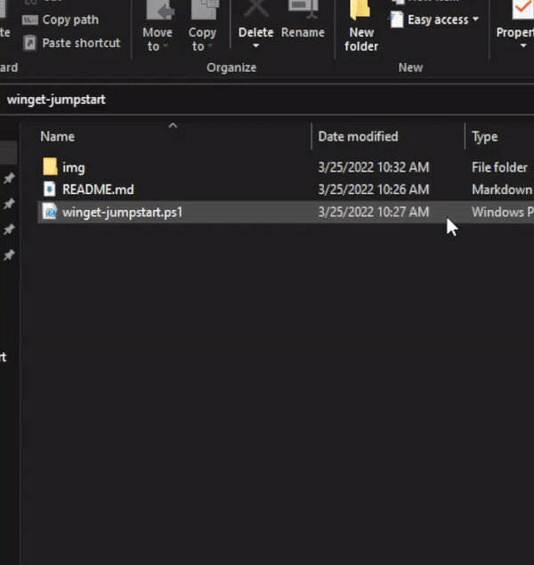
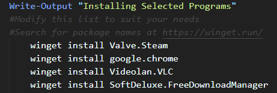

<br>
# Winget Jumpstart


This PowerShell script is made for newly installed instances of Windows.

<br>

## Requirements

* Clone or download the script  from this repo.
```zsh
git clone https://github.com/KrakenSushi/winget-jumpstart.git
``` 
* Update `App Installer` first before auto installing programs by using the Microsoft Store or manually downloading it with this script and installing it.<br><br>
  
 ### Enable running scipts on your Windows system<br><br>
* Run an elevated PowerShell window.
```powershell
Set-ExecutionPolicy RemoteSigned
```
* To disable running scripts on your system, run this command at an elevated PowerShell window.
```powershell
Set-ExecutionPolicy Restricted
```
<br>

## Opening

* Using command line<br>
```sh
./winget-jumpstart.ps1
```

* Using File Explorer<br>


## Selecting programs to install 

* The list of programs to install is under the function `InstallProgs`, modify it to your needs. 
  
* Search for package names using:
  * [winget.run](https://winget.run/) 
  * Using the command line
```cmd
winget search <program_name> 
```
